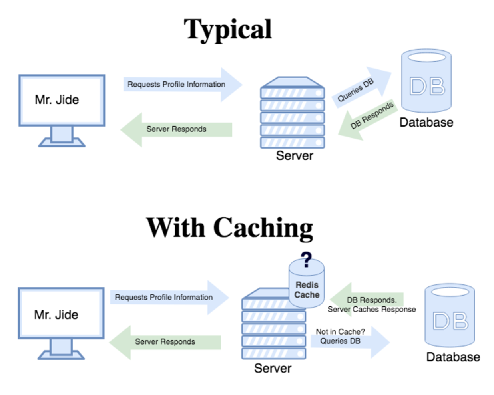
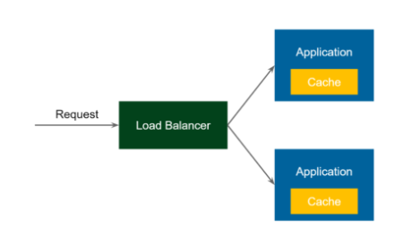
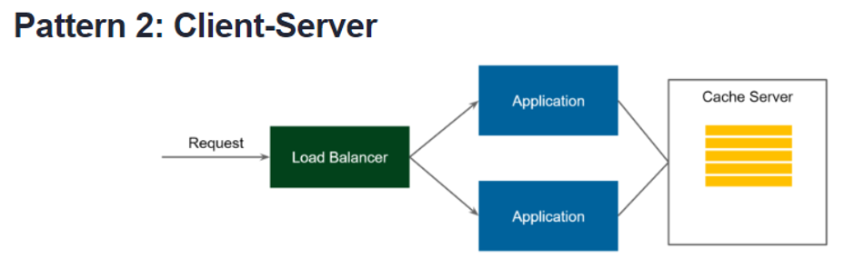
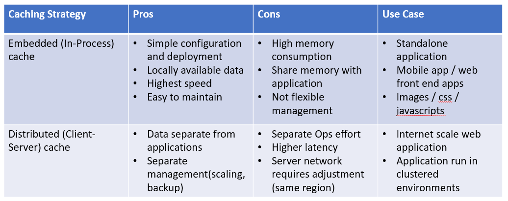

# **Caching with Spring Boot (EhCache, Redis, Apache Geode)**

## **Concept of Caching**

## **Concept of Local Caching (embedded)**

## **Concept of Distributed Caching (client-server)**

## **Pros & Cons**

## **Learning Resources**
**General Links and Tutorial:**
- https://howtodoinjava.com/spring-boot2/spring-boot-cache-example/
- https://www.youtube.com/watch?v=ccfQ1j4suN0
- https://tanzu.vmware.com/content/blog/cache-rules-everything-around-me-when-to-use-redis-and-when-to-use-pivotal-cloud-cache
- https://tanzu.vmware.com/content/blog/an-introduction-to-look-aside-vs-inline-caching-patterns
- https://codeahoy.com/2017/08/11/caching-strategies-and-how-to-choose-the-right-one/
- https://medium.com/datadriveninvestor/all-things-caching-use-cases-benefits-strategies-choosing-a-caching-technology-exploring-fa6c1f2e93aa

**Ehcache:**

- https://www.baeldung.com/spring-boot-ehcache
- https://springframework.guru/using-ehcache-3-in-spring-boot/
- https://www.baeldung.com/spring-boot-evict-cache

**Redis:**

- https://dzone.com/articles/running-redis-on-windows-10 (redis installation)
- https://programmerfriend.com/ultimate-guide-to-redis-cache-with-spring-boot-2-and-spring-data-redis/

**Apache Geode**
- https://www.youtube.com/watch?v=qUs3ftvsEoU
- https://www.youtube.com/watch?v=OvY5wzCtOV0
- https://www.youtube.com/watch?v=qUs3ftvsEoU
- http://www.ynovytskyy.com/2018/03/15/apache-geode-pivotal-gemfire-with-spring-data.html
- https://docs.spring.io/spring-boot-data-geode-build/current/reference/html5/guides/getting-started.html#geode-samples-getting-started-spring-initializer
- https://docs.spring.io/spring-boot-data-geode-build/current/reference/html5/#geode-samples

## **What are the differencec between using EhCache v.s. Redis/Geode?**
 
- EhCache is for **local caching**. In a microservices architecture, it means that what you cache is only for your own own and is not shareable with other peer application.
- Redis/Geode is for distributed caching. That means let's say I have 5 instances of a CRM Application (or we call it Customer MS), all 5 of them will construct their cache at Redis/Geode servers and be able to share the cache.